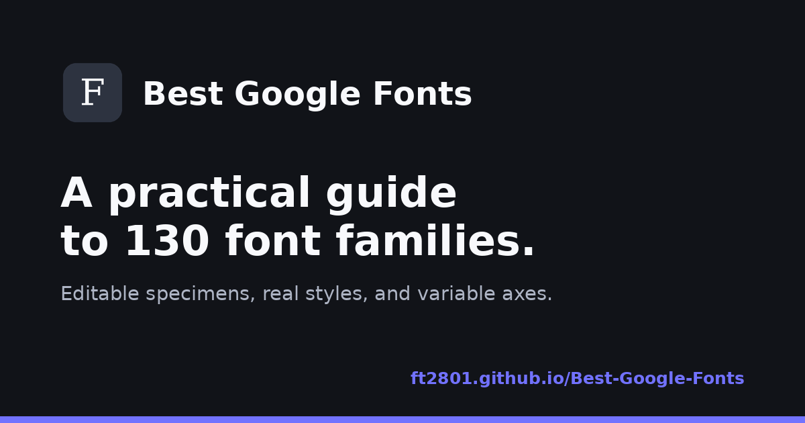

# Best Google Fonts

A practical guide to 130 notable Google Fonts, organized into five chapters with editable specimens and controls generated from each family's real weights, styles, and variable axes.

Live site: [https://ft2801.github.io/Best-Google-Fonts/](https://ft2801.github.io/Best-Google-Fonts/)



## Features

- 130 font families organized alphabetically in five chapters.
- Concise historical and visual descriptions.
- Editable specimens with a default size of 32px.
- Capability-aware controls for weight, width, optical size, slant, roundness, and other variable axes.
- Upfront font loading with a progress indicator.
- Light and dark themes.
- Responsive navigation for desktop, tablet, and mobile.
- Direct links to every family on Google Fonts.

## GitHub Pages

The repository is designed for branch-based GitHub Pages deployment from the `main` branch and the repository root.

The published URL is:

```text
https://ft2801.github.io/Best-Google-Fonts/
```

## Project structure

```text
.
├── assets/
│   ├── apple-touch-icon.png
│   ├── favicon-16x16.png
│   ├── favicon-32x32.png
│   ├── icon-192.png
│   ├── icon-512.png
│   ├── maskable-icon-512.png
│   └── social-preview.png
├── .editorconfig
├── .gitattributes
├── .gitignore
├── .nojekyll
├── 404.html
├── browserconfig.xml
├── CHANGELOG.md
├── CODE_OF_CONDUCT.md
├── CONTRIBUTING.md
├── favicon.ico
├── favicon.svg
├── humans.txt
├── index.html
├── LICENSE
├── README.md
├── robots.txt
├── SECURITY.md
├── sitemap.xml
└── site.webmanifest
```

## Author

Created and maintained by Fabio Tempera.

GitHub profile: [github.com/Ft2801](https://github.com/Ft2801)

## License

The source code is available under the [MIT License](LICENSE).
